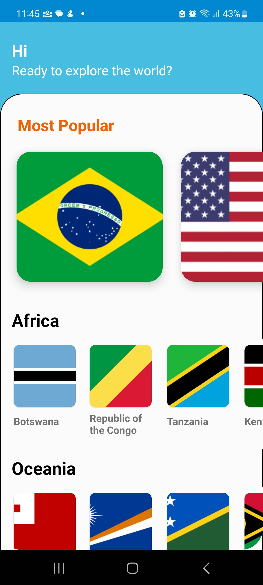
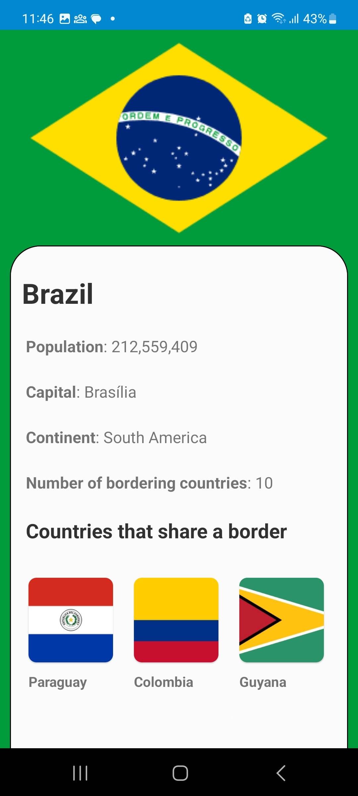

> 

>   🇧🇷 <a href="README.pt.md">Versão em Português</a>
> 

# Countries

**Countries** is a personal Android app created for continuous learning and experimenting with tools, libraries, and practices from the Android ecosystem.

## 🎯 Objective

The main goal of this project is to simulate the evolution of a real Android project by going through major updates and challenges that arise over time. The idea is to work from older versions to the latest ones of libraries and tools such as:

- Gradle
- Android Gradle Plugin (AGP)
- Kotlin
- AndroidX and other core libraries
- Modern architectures and paradigms

Additionally, this project serves as a space to test new features, stay active in coding, and explore best development practices.

## 🔧 Initial Technologies

The project was **intentionally started with older versions** to experience the process of updating a legacy project. Versions used during the initial setup:

- **Gradle**: `6.8.3`
- **AGP**: `4.2.1`
- **Kotlin**: `1.4.21`
- **Architecture**: `MVP (Model-View-Presenter)`

## 🧪 Current Features

- **Home** screen with a list of all countries
- **Overview** screen for a selected country

## 🗂️ Backlog Features

- [ ] Country favorites
- [ ] Filter and search countries
- [ ] Quiz about countries

## 🚧 Technical Backlog

- [ ] Migrate from MVP to MVVM
- [ ] Migrate to Jetpack Compose
- [ ] Add Kotlin Multiplatform (KMP) support
- [ ] Add Compose Multiplatform

## 🧰 Main Libraries and Services Used

- **Firebase Crashlytics** – Real-time crash reporting
- **Firebase Analytics** – Event and user behavior tracking
- **Firebase Messaging** – Allows sending push notifications
- **Firebase Remote Config** – Remote configuration management
- **Firebase App Distribution** – Configured in the CI/CD to make testing easier
- **Datadog** – Observability, tracing, and performance monitoring

---

## 📸 Screenshots

| Home | Country Overview |
|--------------|-----------------|
|  |  |

---

## 🔗 Available on Google Play

