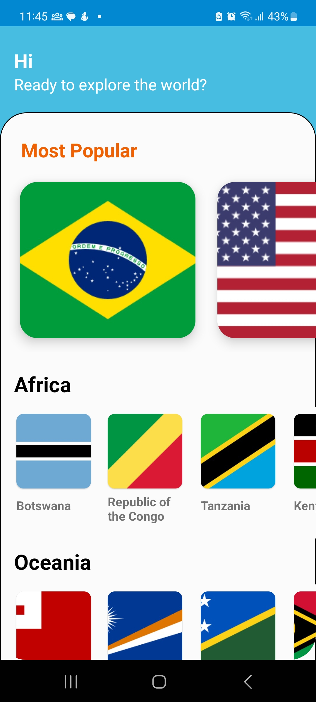

> 

>  🇺🇸 <a href="README.md">English version</a>
> 

# Countries

**Countries** é um aplicativo Android pessoal criado com foco em aprendizado contínuo e experimentação de ferramentas, bibliotecas e práticas do ecossistema Android.

## 🎯 Objetivo

O projeto tem como principal objetivo simular a evolução de um projeto Android real, passando pelas principais atualizações e desafios que surgem ao longo do tempo. A ideia é trabalhar desde versões antigas até as mais recentes de bibliotecas e ferramentas como:

- Gradle
- Android Gradle Plugin (AGP)
- Kotlin
- AndroidX e outras libs core
- Arquiteturas e paradigmas modernos

Além disso, serve como um espaço para testar novas features, manter a prática ativa e explorar boas práticas de desenvolvimento.

## 🔧 Tecnologias Iniciais

O projeto foi **intencionalmente iniciado com versões antigas**, com o objetivo de vivenciar o processo de atualização de um projeto legado. Versões utilizadas na criação:

- **Gradle**: `6.8.3`
- **AGP**: `4.2.1`
- **Kotlin**: `1.4.21`
- **Arquitetura**: `MVP (Model-View-Presenter)`

## 🧪 Funcionalidades atuais

- Tela **home** com uma lista de todos os países
- Tela de **overview** de um país selecionado pelo usuário

## 🗂️ Backlog de funcionalidades

- [ ] Favoritar país
- [ ] Filtrar e buscar países
- [ ] Quiz sobre os países

## 🚧 Backlog técnico

- [ ] Migração de MVP para MVVM
- [ ] Migração para Jetpack Compose
- [ ] Suporte a KMP (Kotlin Multiplatform)
- [ ] Compose Multiplatform

## 🧰 Principais bibliotecas e serviços utilizados

- **Firebase Crashlytics** – Monitoramento de falhas em tempo real
- **Firebase Analytics** – Coleta de eventos e comportamento do usuário
- **Firebase Messaging** – Permite o envio de Push Notification
- **Firebase Remote Config** – Feature toggle para configurações dinâmicas controladas remotamente
- **Firebase App Distribution** – Configurado no CI/CD para facilitar os testes.
- **Datadog** – Observabilidade, rastreamento e monitoramento de performance

---

## 📸 Screenshots

| Home | Country Overview |
|--------------|-----------------|
|  |  |

---

## 🔗 Disponível na Google Play

